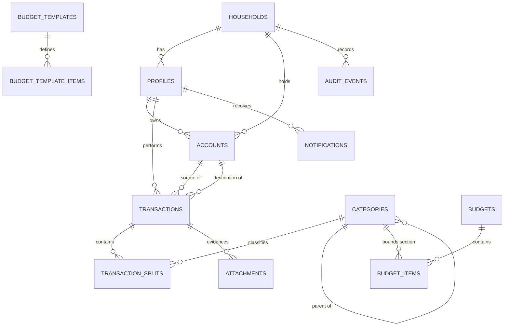

# HOUSEHOLD FINANCE OS — MASTER TECHNICAL SPECIFICATION

**Status:** DRAFT — underway. Parts 0–4 written (Phases 1–3 owner-approved 2026-09-29; Phase 4 awaiting review). Phases 5–8 follow.
**Authority:** This document is the single source of truth ("the law") for all implementation.
Only the architect (with the owner) edits it. Implementation agents read; they never write.
**History:** Planning commissioned 2026-09-28. Decisions №1–13 locked in `docs/ai/AI-CONTEXT.md`.
Phase-1 scope decisions approved 2026-09-28; Phases 1–3 approved 2026-09-29 (visibility 'shared').

**Conventions used throughout**
- Requirement IDs: `FR-<domain>-<n>` (functional), `NFR-<domain>-<n>` (non-functional),
  `INV-<n>` (financial invariants), `SCR-<n>` (screens), `RISK-<type>-<n>`.
- Normative language: **MUST** = required for correctness/security · **SHOULD** = expected unless
  justified · **MAY** = optional.
- Money: written `Rs. 12,500` in prose; stored as integer cents everywhere (§10).
- "V1" = the MVP + accepted scope decisions. "v1.1" and "Future" per §84–86 (Phase 8) and the
  scope classifications inline (`[MVP]` / `[v1.1]` / `[FUTURE]`).

---
---

# PHASE 1 — PRODUCT SPECIFICATION

## §1 Product vision

A private **household financial operating system** for one Sri Lankan family of four. Cash-first,
plan-vs-actual at its core: **Appa defines the plan, people record what actually happened, the
system continuously calculates the difference.** It is not a bank client, not a spreadsheet, not
accounting software — it is a calm, fast daily tool whose data model is rigorous enough that
*every rupee can be explained*.

Dual purpose: the same codebase powers (a) the private family deployment and (b) a public,
fictional-data **demo deployment** that doubles as a portfolio exhibit of engineering quality.

## §2 Goals

| # | Goal |
|---|---|
| G1 | Amma records an expense in ~3 interactions / ≤10 seconds, offline-safe — every time, no friction. |
| G2 | Appa sees household financial state at a glance (cash, budgets, spend, commitments) without doing data entry. |
| G3 | Diva/Anu log personal income+expenses daily with near-zero effort; personal analytics follow automatically. |
| G4 | One authoritative ledger: balances, budget remaining, analytics are all *computed*, never hand-maintained. |
| G5 | Physical cash is a first-class citizen alongside bank balances. |
| G6 | Security is structural (RLS + audit + role contexts), generosity of UX never bypasses it. |
| G7 | v1.1: replace Appa's FD/insurance spreadsheet with flexible trackers + countdowns + reminders. |
| G8 | Portfolio-grade demo with zero real data, hard-isolated from the family deployment. |

## §3 Non-goals

- **N1** No direct bank integration / no bank credentials stored (V1).
- **N2** Not double-entry bookkeeping UX — accounting rigor stays under the hood; users see plain language.
- **N3** No LLM/AI features in V1 (suggestions are deterministic; architecture leaves room later).
- **N4** Not multi-household SaaS — exactly one household (+ the fictional demo household).
- **N5** No investment trading, no crypto, no bill payment execution.
- **N6** No native iOS (Android + web only).
- **N7** No social/sharing features.
- **N8** No enterprise infrastructure (microservices/K8s/event buses) — modular monolith by design.

## §4 User personas

- **APPA (50s), Household Admin.** Salaried; manages FDs, insurance, the family plan. Time-poor,
  detail-oriented. Smartphone + company PC (browser). Will *not* do routine data entry; wants
  answers (where did it go? are we on plan? what's coming due?). Treats the app as his control
  room. Owns the Vault.
- **AMMA (40s–50s), Household Expense User.** Runs daily household spending, heavily cash-based.
  Smartphone-only. Low tolerance for forms, logins, or anything that "asks questions". Success =
  the app never slows her down and never loses an entry. Trust is earned by instant, visible saves.
- **DIVA (20s), Normal User + Super Admin.** Part-time teaching income (irregular, daily logging).
  Also the system's developer/operator. Two cleanly-separated role contexts (§5 R5a/R5b).
  Portfolio stakeholder: the demo deployment showcases her engineering.
- **ANU (late teens/20s), Normal User.** Part-time income, personal spending, savings goals.
  Smartphone-only. Needs daily income entry that tolerates skipped days gracefully.

## §5 User roles

| Code | Role | Holder | Summary |
|---|---|---|---|
| R1 | HOUSEHOLD_ADMIN | Appa | Plans, budgets, allocates, monitors, manages categories/trackers/config-grants; corrects member records (audited); owns Vault; receives security alerts. |
| R2 | HOUSEHOLD_MEMBER+ | Amma | Everything R3 can do, plus spends against household budget sections and manages shared cash flows. |
| R3 | MEMBER | Diva, Anu | Personal income/expense/cash/savings tracking, personal analytics; household visibility only per grants. |
| R4 | (same R1) | — | R1 grants to members are granular: Appa MAY grant view/edit on specific trackers/sections to anyone (§17). |
| R5a | MEMBER (normal context) | Diva | Ordinary R3 session. Violations in this context raise security alerts to Appa. |
| R5b | SUPER_ADMIN (context) | Diva | Maintenance powers: users/roles, repair any data, system config, full audit view. Activated by explicit step-up auth. Always audited; **never notifies Appa**. |

**Role context rule.** Diva has one account. Each session carries an explicit
`role_context ∈ {member, super_admin}` (§30). Switching to `super_admin` requires step-up
authentication and is itself an audited event. The distinction — not the person — determines both
permissions and alert behavior (§24).

## §6 Permission matrix (capability overview)

✓ = allowed · ◐ = per-grant/partial scope · ✗ = denied (RLS-enforced)

| Capability (detailed spec in Phase 3/4) | Appa R1 | Amma R2 | Diva R5a | Anu R3 | Diva R5b |
|---|---|---|---|---|---|
| Record own expense/income/transfer | ✓ | ✓ | ✓ | ✓ | ✓ |
| Operate own cash wallet | ✓ | ✓ | ✓ | ✓ | ✓ |
| Spend against household budget sections | ✓ | ✓ | ◐ | ◐ | ✓ |
| View own timeline + personal analytics | ✓ | ✓ | ✓ | ✓ | ✓ |
| View household dashboards/aggregates | ✓ | ◐ (relevant budgets) | ◐ | ◐ | ✓ |
| Create/edit budgets + templates, allocations | ✓ | ✗ | ✗ | ✗ | ✓ |
| Manage categories | ✓ | suggest-only | ✗ | ✗ | ✓ |
| Correct/void others' records (audited reversal) | ✓ | own recent entries | ✗ | ✗ | ✓ |
| Vault: view trackers | ✓ | ◐ per grant | ◐ per grant | ◐ per grant | ✓ |
| Vault: create/edit trackers & documents | ✓ | ✗ | ✗ | ✗ | ✓ |
| Manage per-tracker view/edit grants | ✓ | ✗ | ✗ | ✗ | ✓ |
| Manage users, roles, sessions (revoke) | ✗ | ✗ | ✗ | ✗ | ✓ |
| View audit log | ◐ household scope | ✗ | own events | own events | ✓ full |
| Receive security-alert notifications | ✓ | ✗ | ✗ | ✗ | ✗ (generates, never receives) |
| System config, backups, demo reseed | ✗ | ✗ | ✗ | ✗ | ✓ |

## §7 Core user journeys (detailed flows in Phase 5)

1. **AMMA / fast expense:** open → (biometric unlock) → cash visible → + Expense → amount → label
   w/ autocomplete → (optional split/receipt) → save → timeline + budget + wallet update instantly.
2. **ANU / daily income:** open → + Income → amount + source → save → month income total updates.
   Skipped days need no action.
3. **DIVA / earn → save:** record income (lands in her cash wallet) → later transfer wallet→bank
   savings (separate transaction; never double-counted) → personal analytics reflect both.
4. **APPA / monthly plan:** login → dashboard review → create September from "Normal Month"
   template → adjust allocations → monitor vs actual through the month → act on alerts.
5. **DIVA (R5b) / maintenance:** step-up into Super Admin → correct a mis-entered expense → audit
   row written → no Appa notification. Contrast: R5a attempt to open the Vault → denied + audited
   + Appa notified (§24).

## §8 Functional requirements (V1 unless tagged)

**Auth & sessions**
- `FR-AUTH-01` Username + password sign-in (no email UX); per-member accounts. [MVP]
- `FR-AUTH-02` Persistent device session; explicit **Lock now**; inactivity auto-lock. [MVP]
- `FR-AUTH-03` Biometric app unlock with password fallback. [MVP]
- `FR-AUTH-04` Role-context switch (member ⇄ super_admin) requires step-up auth; audited. [MVP — context model even if switch UI lands in v1.1]
- `FR-AUTH-05` Vault entry requires step-up re-authentication. [v1.1]
- `FR-AUTH-06` Session/device list + revoke (own: self; R5b: anyone). [v1.1]

**Entry & capture**
- `FR-EXP-01` Add expense: amount + label (+category optional) saved in ≤3 interactions. [MVP]
- `FR-EXP-02` One expense MAY split across multiple categories; splits MUST sum to total (INV-03). [MVP]
- `FR-EXP-03` Receipt photo (camera/gallery) attachable at entry; queued offline upload. [MVP]
- `FR-EXP-04` Edit/void own recent entries; corrections render as reversal entries, never silent edits. [MVP]
- `FR-INC-01` Add income: date + amount + source; daily granularity; zero-days require no entry. [MVP]
- `FR-TRF-01` Cash transfer wallet→wallet between members (e.g., Appa→Amma allocation). [MVP]
- `FR-TRF-02` Cash→bank deposit; bank→cash withdrawal; cash→savings transfers. [MVP]
- `FR-ADJ-01` Balance correction against an adjustment account; mandatory reason; audited. [MVP]
- `FR-SUG-01` Label autocomplete ranked by frequency + recency + same-user history + category association; deterministic. [MVP]
- `FR-SUG-02` Accepting a suggestion applies its label + default category mapping. [MVP]

**Offline**
- `FR-OFF-01` All entry types (expense/income/transfer/receipt) write to a durable local outbox
  first and render instantly. [MVP]
- `FR-OFF-02` Sync is idempotent (client UUID key), retried with backoff; states
  `local → pending → synced | failed` are visible. [MVP]
- `FR-OFF-03` Conflicts: entries are append-only (no conflict possible); balance corrections and
  config use last-writer-wins with audit trail. [MVP]

**Budgets**
- `FR-BUD-01` Monthly budget created from (a) template, (b) previous month, or (c) blank. [MVP]
- `FR-BUD-02` Budget sections bind to a category subtree with an allocated amount. [MVP]
- `FR-BUD-03` Live per-section + total: allocated / spent / remaining / %used — always computed. [MVP]
- `FR-BUD-04` Per-section rollover toggle; applied when generating the next month (§14). [MVP]
- `FR-BUD-05` Budget-vs-actual view with member attribution. [MVP]

**Timeline, dashboards, analytics**
- `FR-TL-01` Chronological household timeline, day-grouped, member-attributed, permission-filtered. [MVP]
- `FR-DASH-01` Appa dashboard: total cash, month spend vs budget, remaining, savings, category
  breakdown, member activity, alerts. [MVP]
- `FR-DASH-02` Personal analytics per member (income, expenses, savings transfers, categories, trends). [MVP]
- `FR-ANA-01` Multi-month trends + month-over-month comparison. [v1.1]

**Trackers & commitments (v1.1)**
- `FR-TRK-01` Flexible trackers w/ custom typed fields (text/number/currency/%/date/datetime/bool/dropdown/document/note). [v1.1]
- `FR-TRK-02` Tracker timeline view + live maturity/renewal countdown (adaptive precision). [v1.1]
- `FR-RCM-01` Recurring commitments: frequency, next occurrence, payment history, ✓Paid. [v1.1]
- `FR-RMD-01` Reminders for commitments/maturities w/ configurable offsets. [v1.1]

**Audit, security, notifications**
- `FR-AUD-01` Append-only audit for money/config/permission mutations: actor, role-context, old→new, ts, session, reason. [MVP]
- `FR-AUD-02` Audit viewer: Appa = household scope; members = own events; R5b = full. [MVP]
- `FR-SEC-01` Access violation in protected area (member context) → audit + in-app alert to Appa. [MVP]
- `FR-NOT-01` In-app notification center. [MVP]
- `FR-TG-01` Telegram bot push for alerts + reminders. [v1.1]

**Categories**
- `FR-CAT-01` Seeded hierarchical English category tree (§8 of brief; full seed list in Phase 3). [MVP]
- `FR-CAT-02` Appa/R5b manage the tree (add/rename/deactivate; no destructive delete of used nodes). [MVP]

**Demo**
- `FR-DEMO-01` Five one-tap demo personas on demo URL sign-in (password `demo1234`). [MVP]
- `FR-DEMO-02` Fictional multi-month realistic dataset covering every feature. [MVP]
- `FR-DEMO-03` Nightly automated reseed (cron). [MVP — or v1.1 if cron lands late; manual reseed acceptable at launch]
- `FR-DEMO-04` Demo = separate Supabase project + URL; no code path couples it to real data. [MVP]

## §9 Non-functional requirements

- `NFR-PRF-01` Cold start ≤2.5 s on mid-range Android; entry save acknowledged ≤300 ms (local write).
- `NFR-PRF-02` Timeline/dashboard scroll at ~60 fps; virtualized lists; month views paginate.
- `NFR-OFF-01` Zero loss of offline entries across app restarts/network failures.
- `NFR-SEC-01` RLS enabled and tested on **every** table; denies verified by automated tests.
- `NFR-SEC-02` TLS in transit; provider-managed encryption at rest; encrypted backups (§37).
- `NFR-SEC-03` No third-party analytics/tracking/crash SDKs (privacy posture for family data).
- `NFR-SEC-04` service_role key never in client/git; anon key is public-by-design (RLS guards).
- `NFR-PRI-01` No bank credentials anywhere in the system (N1).
- `NFR-CMP-01` Android 8+ (API 26+) phones; web on evergreen Chrome/Edge (responsive to 360 px).
- `NFR-AVL-01` Managed cloud backups; MVP targets RPO ≤24 h, RTO ≤1 day (§38 DR plan).
- `NFR-USB-01` Amma core task (add expense) median ≤10 s, no required fields beyond amount+label.
- `NFR-LOC-01` All UI strings externalized; Tamil/Sinhala translation must not require code change.
- `NFR-PRT-01` One codebase ships both targets: Android APK (GitHub Releases) + Web (GitHub Pages).
- `NFR-MNT-01` Every screen ships loading/empty/error/offline states (Phase 5 inventory, §41).

---
---

# PHASE 2 — THE FINANCIAL SYSTEM

## §10 Financial concepts

The domain model in one paragraph: a **Household** contains **Members**. Each member owns
**Accounts** — most importantly a **Cash Wallet** (physical money on their person) and optionally
**Bank Accounts**. Value moves only via **Transactions** recorded in an **append-only Ledger**;
every transaction names a **source account** and a **destination account**. Money the family
receives comes *from* a virtual `EXTERNAL` account; money spent goes *to* it. **Categories** form
a tree; expenses (or their **splits**) point at category leaves. A **Budget** is a monthly plan
whose **sections** bind allocations to category subtrees. **Trackers** (v1.1) and **Recurring
Commitments** (v1.1) model instruments and obligations. Every sensitive mutation emits an
**Audit Event**.

**Money representation.** All amounts are `BIGINT` minor units (cents). `Rs. 12,500.50` =
`1250050`. Floats anywhere near money are defects (`CODING-RULES`). LKR-only V1; a `currency
CHAR(3) DEFAULT 'LKR'` column keeps the door open without multi-currency logic now.

## §11 Transaction model (the heart)

One table, five types. Invariant INV-02: **source and destination are always present and never
equal** — therefore no transaction can mint or vaporize money.

| Type | Meaning | Source → Destination | Consumes budget? | Analytics bucket |
|---|---|---|---|---|
| `income` | Money enters the household | `EXTERNAL` → member wallet/bank | no | Income |
| `expense` | Money leaves for goods/services | member wallet/bank → `EXTERNAL` | **yes** (its category) | Expense |
| `transfer` | Move between own-system accounts | wallet/bank → wallet/bank | no | **Excluded** from income/expense |
| `allocation` | Semantic sub-type of transfer: member→member handover with intent (e.g., Appa funds Amma) | wallet → wallet | no | Excluded (shown as "Allocated") |
| `adjustment` | Correction to reconcile reality | `EXTERNAL_ADJ` → account, or account → `EXTERNAL_ADJ` | no | Excluded; always audited w/ reason |

**Split expenses.** An expense has 1..n `transaction_splits`, each `{category_id, amount_cents,
note?}`. INV-03: `SUM(splits) == transaction.amount_cents` (DB-enforced, §25). Single-category
expense = one split — so the fast path and the split path are the same code path, never two.

**Transfer neutrality** (INV-06): analytics MUST compute income/expense from types `income` /
`expense` only. Depositing Rs. 5,000 to the bank changes account composition, never "income".

**Timeline ordering fields:** `occurred_at` (user-facing time, editable for backdating) vs
`created_at` (system). Sorting/period bucketing uses `occurred_at`; audit uses `created_at`.
All timestamps stored `timestamptz` UTC; rendered in `Asia/Colombo`.

## §12 Cash model

- Each member has exactly one implicit **Cash Wallet** (auto-created, cannot be deleted).
- `wallet_balance = SUM(inflows) − SUM(outflows)` per wallet — computed (INV-04); a cached
  materialization MAY exist for performance if provably refreshable (§27 strategy).
- **Wallets MUST NOT go negative** (INV-10). The service layer rejects overdraws; when reality
  disagrees (miscounted cash), the user records an explicit `adjustment` with a reason.
- Cash handover between members = `transfer`/`allocation` wallet→wallet; balances move atomically
  (one transaction row, two deltas).
- UX law: **"Cash available" (wallet) and "Budget remaining" (plan) are different numbers, always
  labeled as such.** A cash top-up changes the wallet; only spending changes budget remaining.

## §13 Bank account model

- `bank_accounts`: owner member, bank name, type (`savings | current | other`), notes,
  attachments (v1.1), visibility grants (Phase 4). [MVP: savings/current, owner=member or household]
- **Two balance modes** (column `balance_mode`):
  - `derived` — balance computed from transactions touching the account (disciplined users);
  - `manual` — user occasionally sets the balance; the system inserts an `adjustment` transaction
    to reconcile (audited). This honors "don't force recording every bank movement".
- Bank deposits/withdrawals are `transfer` between wallet and bank account — both sides real.

## §14 Budget model

- `budget_periods`: month (calendar, per locked decision #8) defined by `start_date/end_date`.
- `budget_templates` + `budget_template_items`: reusable plans ("Normal Month").
- `budgets` + `budget_items`: the live month. Each item = `{category_id (subtree root),
  allocated_cents, rollover:bool}`.
- **Section↔category binding (INV-09):** spending consumes a section when an expense split's
  category is inside the item's subtree. Cash handovers and transfers consume nothing.
- Computed per item and in total:
  `spent = Σ expense splits under subtree within period · remaining = allocated − spent ·
   pct_used = spent/allocated`. Remaining is **never stored** (INV-04).
- **Generation:** new month from template or copy-previous. For each source item with
  `rollover=true`, `allocated_new = allocated_base + remaining_previous` (remaining may be
  negative → budget shrinks; this is intentional feedback, not an error).
- **Editing:** allocations may change mid-month (audited). Sections may be added/removed; removing
  one with spending keeps historical reporting (item is closed, not erased).
- Overspend is *displayed* (negative remaining, amber→red), never blocked — real life overspends;
  the system informs, Appa decides.

## §15 Income model

Income = transaction type `income` into wallet or bank, with `source_label` (free text, e.g.
"Teaching") and optional income-category. Daily, irregular, zero-day-tolerant. Monthly income
totals/trends are pure `SUM`/`GROUP BY` over the ledger — no separate "income log" to reconcile.

## §16 Expense model

Expense = wallet/bank → `EXTERNAL`, 1..n splits into category leaves, fields: `label` (what was
bought — the autocomplete key), `merchant?`, `note?`, `occurred_at`, receipt attachments.
`label + category` pairs feed the suggestion engine (FR-SUG-01): ranking inputs are
global frequency, **same-user** frequency, recency (decay), and prefix/substring match score —
all computable in SQL/indexed local queries; no network needed for suggestions [offline!].

## §17 Transfer model

Four idiomatic flows, one mechanism:
1. **Handover** — Appa wallet → Amma wallet (`allocation` if earmarked, else `transfer`).
2. **Deposit** — wallet → own bank account.
3. **Withdrawal** — bank account → wallet.
4. **Saving** — wallet/bank → savings-typed bank account.
Permissions: a member may move money out of **their own** accounts; Appa R1 may additionally move
from the household funding account (his) to members. Every movement is one ledger row — atomic.

## §18 Savings model

Deliberately **not** a special subsystem: savings = a bank account with `type='savings'`.
"Money transferred to savings" is a transfer (INV-06 keeps it out of expense analytics).
Savings *progress* = that account's balance (derived) + optional target/goal field [v1.1].
This avoids the classic double-count every naive tracker makes.

## §19 Financial tracker model [v1.1, architecture fixed now]

Replace-the-spreadsheet system, schema-stable:
- `tracker_types`: kind enum seed (`fixed_deposit, insurance, investment, loan, recurring_payment,
  savings_instrument, custom`) — controls iconography/defaults only, **not** field structure.
- `trackers`: owner, name, type, status, visibility (Phase 4 grants).
- `tracker_field_defs` (per tracker): ordered, typed fields per FR-TRK-01 → EAV
  (`tracker_field_values`) with typed columns (`value_text/num/cents/date/bool/json`).
- `tracker_events`: dated timeline entries (opened, interest_updated, renewed, matured, note,
  document) → powers the chat-style timeline + countdowns. Countdowns render with adaptive
  precision (years+months when far, days+hours when near; §19 of brief, UX in Phase 5).
- FD-style computed helpers (maturity date from start+term, simple projection from principal×rate)
  are display conveniences, never write "expected interest" into the ledger as money.

## §20 Recurring commitment model [v1.1]

`recurring_commitments`: `{payee/label, amount_cents, frequency(weekly|monthly|quarterly|annual),
start, next_due, reminder_offsets:int[] (days), status}`. `commitment_occurrences`: one row per
cycle `{due_date, status(pending|paid|skipped), paid_txn_id?}`. Marking ✓Paid optionally creates
the matching expense transaction (linked) — one action, two consistent artifacts, no double entry
in analytics (the link, not a copy, is shown). A scheduler (Supabase cron + Edge Function)
advances `next_due` and emits reminders (§75).

## §21 Audit model

`audit_events` — append-only, trigger/service-written for: money mutations beyond own basic entry,
corrections/voids, adjustments, budget changes, category changes, grants/role changes, role-context
switches, vault access/mutations, security violations, session revocations, backup/export.
Fields: `actor_id, role_context, action, resource_type, resource_id, old_jsonb, new_jsonb,
reason?, session_id, device_summary, created_at`. **No UPDATE/DELETE privileges for any role**
(including R5b) — enforced by revoking grants + a `BEFORE UPDATE OR DELETE` trigger that raises.
Retention: forever (household volumes are tiny; §27). FR-AUD-02 governs who *reads* what.

**The five load-bearing invariants** (full formal list with enforcement points lands in §28/Phase 3):
- INV-01 integer cents · INV-02 source↔destination integrity · INV-03 splits sum to parent ·
  INV-04 derived balances/remaining only · INV-05 void-not-delete (history is stable) ·
  INV-06 transfer neutrality · INV-07 idempotent entries · INV-08 auditable mutations ·
  INV-09 budgets consume on expense only · INV-10 wallets never negative.

---
# PHASE 3 — DATA ARCHITECTURE (§22–§28)

*This phase is design authority for the database. It is written as design-DDL for precision —
it is still a SPECIFICATION, not a migration. Implementation agents translate it into versioned
Supabase migrations in Phase 02+ without re-deciding anything here. Naming: snake_case; PKs `id`;
FKs `<entity>_id`; timestamps `timestamptz` default `now()`; soft delete via `deleted_at` where noted.*

## §22 ER diagram (core V1 entities)



Read: everything that RLS guards carries `household_id NOT NULL`. Money moves only inside
`transactions` (+`transaction_splits`). Everything else is structure, plan, or record.

## §23 Database schema (design-DDL)

### A. Identity & authorization

```sql
create table households (
  id uuid primary key default gen_random_uuid(),
  name text not null,
  kind text not null default 'family' check (kind in ('family','demo')),  -- demo isolation marker
  created_at timestamptz not null default now()
);

create table profiles (
  id uuid primary key references auth.users(id) on delete restrict,
  household_id uuid not null references households(id),
  username citext not null unique,                    -- UX login id; auth email = username@hfos.internal
  display_name text not null,                          -- Appa / Amma / Diva / Anu
  primary_role text not null check (primary_role in ('household_admin','expense_user','member')),
  is_super_admin boolean not null default false,       -- capability flag; CONTEXT comes from session claim
  default_visibility text not null default 'shared' check (default_visibility in ('shared','private')),
  avatar_emoji text, avatar_color text,
  is_active boolean not null default true,
  created_at timestamptz not null default now(),
  updated_at timestamptz not null default now(),
  deleted_at timestamptz                                -- soft delete; never hard-remove history actors
);
-- Role context ≠ account. JWT carries app_metadata: { household_id, primary_role, is_super_admin }.
-- Session-level `role_context` claim ('member' | 'super_admin') minted only after step-up (Phase 4 §30).
```

### B. Ledger core

```sql
create type account_kind as enum ('person_cash','bank','external_system');
create type bank_account_type as enum ('savings','current','other');
create type balance_mode as enum ('derived','manual');
create type txn_type as enum ('income','expense','transfer','allocation','adjustment');

create table accounts (
  id uuid primary key default gen_random_uuid(),
  household_id uuid not null references households(id),
  kind account_kind not null,
  owner_profile_id uuid references profiles(id),       -- null ONLY for external_system
  name text not null,                                   -- "Amma Cash", "Sampath Savings", "EXTERNAL"
  bank_name text, bank_type bank_account_type,
  balance_mode balance_mode not null default 'derived',
  currency char(3) not null default 'LKR',
  is_archived boolean not null default false,
  created_at timestamptz not null default now(),
  deleted_at timestamptz,
  check ( (kind='external_system') = (owner_profile_id is null) )   -- wallets/banks need owners; EXTERNAL doesn't
);
-- Seeded per household: one EXTERNAL + one EXTERNAL_ADJ (external_system),
-- and per profile: one person_cash wallet, auto-created by trigger on profile insert.

create table categories (
  id uuid primary key default gen_random_uuid(),
  household_id uuid not null references households(id),
  parent_id uuid references categories(id),
  name text not null,                                   -- English (V1)
  name_ta text, name_si text,                           -- localization-ready (unused V1)
  icon text, sort_order int not null default 0,
  kind text not null default 'expense' check (kind in ('expense','income','both')),
  is_active boolean not null default true,              -- deactivate ≠ delete (preserve history)
  created_at timestamptz not null default now(), deleted_at timestamptz,
  unique (household_id, coalesce(parent_id, id), name)  -- sibling names unique per subtree level
);

create table transactions (
  id uuid primary key default gen_random_uuid(),        -- also the client idempotency anchor companion
  idempotency_key uuid not null unique,                  -- client-generated; INV-07 dedupe
  household_id uuid not null references households(id),
  type txn_type not null,
  amount_cents bigint not null check (amount_cents > 0),
  currency char(3) not null default 'LKR',
  source_account_id uuid not null references accounts(id),
  dest_account_id   uuid not null references accounts(id),
  member_id uuid not null references profiles(id),       -- whom it is attributed to
  created_by uuid not null references profiles(id),      -- actor (≠ member when Appa corrects)
  label text,                                            -- "Rice" (expense) / "Teaching" (income)
  merchant text, source_label text, note text,
  visibility text not null default 'shared' check (visibility in ('shared','private')),
  occurred_at timestamptz not null,                      -- user-facing; may be backdated
  voided boolean not null default false,                 -- INV-05: void-not-delete
  void_reason text, voided_by uuid references profiles(id), voided_at timestamptz,
  created_at timestamptz not null default now(),
  check (source_account_id <> dest_account_id),
  check (voided = false or (void_reason is not null and voided_by is not null))
);

create table transaction_splits (
  id uuid primary key default gen_random_uuid(),
  transaction_id uuid not null references transactions(id),
  category_id uuid not null references categories(id),
  amount_cents bigint not null check (amount_cents > 0),
  label text, note text
);
-- Expense MUST have ≥1 split (fast path = single split). INV-03 enforced by deferred constraint
-- trigger: SUM(splits) = parent.amount_cents, validated at COMMIT time.

create table attachments (
  id uuid primary key default gen_random_uuid(),
  household_id uuid not null references households(id),
  transaction_id uuid references transactions(id),       -- receipts now; documents arrive v1.1
  storage_path text not null,                            -- Supabase Storage key (bucket 'receipts')
  content_type text not null, size_bytes bigint,
  upload_status text not null default 'pending' check (upload_status in ('pending','uploaded','failed')),
  created_by uuid not null references profiles(id),
  created_at timestamptz not null default now(), deleted_at timestamptz
);
```

### C. Budgets

```sql
create table budget_templates (
  id uuid primary key default gen_random_uuid(),
  household_id uuid not null references households(id),
  name text not null,                                    -- "Normal Month"
  is_archived boolean not null default false,
  created_at timestamptz not null default now()
);
create table budget_template_items (
  template_id uuid references budget_templates(id) on delete cascade,
  category_id uuid references categories(id),
  allocated_cents bigint not null check (allocated_cents >= 0),
  rollover boolean not null default false,
  sort_order int not null default 0,
  primary key (template_id, category_id)
);

create table budgets (
  id uuid primary key default gen_random_uuid(),
  household_id uuid not null references households(id),
  year int not null, month int not null check (month between 1 and 12),
  start_date date not null, end_date date not null,      -- calendar month per decision #8
  status text not null default 'open' check (status in ('open','closed')),
  generated_from text not null default 'blank' check (generated_from in ('template','copy_previous','blank')),
  created_by uuid not null references profiles(id),
  created_at timestamptz not null default now(),
  unique (household_id, year, month)                     -- one budget per month, structurally
);
create table budget_items (
  id uuid primary key default gen_random_uuid(),
  budget_id uuid not null references budgets(id) on delete restrict,
  category_id uuid not null references categories(id),   -- section root (subtree bind, INV-09)
  allocated_cents bigint not null check (allocated_cents >= 0),
  rollover boolean not null default false,
  carry_in_cents bigint not null default 0,              -- provenance of rolled amount (±), informational
  sort_order int not null default 0,
  unique (budget_id, category_id)
);
-- allocated/spent/remaining/% are computed by views (§23-F). carry_in is provenance, never truth.
```

### D. Audit & notifications

```sql
create table audit_events (
  id bigint generated always as identity primary key,
  household_id uuid not null references households(id),
  actor_id uuid references profiles(id),
  role_context text not null,                            -- e.g. 'household_admin' | 'super_admin' | 'member'
  action text not null,                                  -- 'txn.void','txn.adjust','budget.update','grant.set','role.switch','vault.mutate', ...
  resource_type text not null, resource_id text,
  old jsonb, new jsonb, reason text,
  session_id uuid, device_summary text,
  created_at timestamptz not null default now()
);
-- revoke update, delete on audit_events from all roles; guard trigger raises on any attempt. Append-only.

create table notifications (
  id uuid primary key default gen_random_uuid(),
  household_id uuid not null references households(id),
  recipient_id uuid not null references profiles(id),
  kind text not null check (kind in ('security_alert','reminder','info')),
  title text not null, body text, data jsonb,
  read_at timestamptz,
  created_at timestamptz not null default now()
);
```

### E. v1.1 groups (design fixed now, built later)

`trackers(id, household_id, owner_profile_id, tracker_type, name, status, created_at, deleted_at)` ·
`tracker_grants(tracker_id, profile_id, can_view, can_edit, primary key(tracker_id, profile_id))` ·
`tracker_field_defs(id, tracker_id, key, label, field_type(check: text|number|currency|percent|date|datetime|boolean|dropdown|document|note), options jsonb, sort_order, required)` ·
`tracker_field_values(tracker_id, field_def_id, value_text, value_num, value_cents bigint, value_date, value_bool, value_jsonb, primary key(tracker_id, field_def_id))` ·
`tracker_events(id, tracker_id, event_type, event_date, payload jsonb, created_by, created_at)` ·
`recurring_commitments(id, household_id, label, amount_cents, frequency(enum daily|weekly|monthly|quarterly|annual), start_date, next_due date, reminder_offsets int[], status)` ·
`commitment_occurrences(id, commitment_id, due_date, status(pending|paid|skipped), paid_transaction_id references transactions(id))`.

### F. Computed views (the only balance math that exists)

```sql
v_account_balances    -- per account: SUM(inflows)−SUM(outflows) over non-voided txns (INV-04)
v_wallet_view         -- person_cash slice of the above, joined to profiles
v_budget_actuals      -- per budget_item: SUM(expense splits within subtree ∩ period, non-voided)
v_budget_view         -- allocated · spent · remaining (allocated−spent) · pct_used — never stored
v_member_month_totals -- per member/month: income, expenses, transfers_out/in, savings_out
```
Category subtree resolution: recursive CTE in the v_budget_actuals view; depth capped ≤3 by
creation trigger, so recursion is constant-cheap.

## §24 Relationships (FK semantics & referential actions)

- **All FKs `NO ACTION/RESTRICT` as default.** Financial history is never cascade-deleted.
  The only `ON DELETE CASCADE` in the system is template→template_items (templates are pure
  config; deleting a template must never touch live budgets).
- `transactions.member_id` (attribution) vs `created_by` (actor) differ only during admin
  corrections — analytics group on `member_id`; audit binds `created_by`.
- `transactions.source/dest` → `accounts`: RESTRICT (an account with history is archived, not deleted).
- `transactions.member_id` → household EXTERNAL/EXTERNAL_ADJ accounts exist per household and are
  conventional rows like any other (no special storage semantics — just never owned, never archived).
- `attachments.transaction_id` nullable: v1.1 vault documents reuse the table with a different linkage.
- **`auth.users` is never referenced from domain logic** except `profiles.id` — everything families
  touch hangs off `profiles`, keeping auth replaceable.

## §25 Constraints (beyond column CHECKs above)

| # | Rule | Mechanism |
|---|---|---|
| C1 | Splits sum = parent (INV-03) | `CONSTRAINT TRIGGER ... INITIALLY DEFERRED` on `transaction_splits` validating at COMMIT |
| C2 | Endpoint legality by type (expense→EXTERNAL, income←EXTERNAL, transfer/allocation internal-only, adjustment↔EXTERNAL_ADJ) | `BEFORE INSERT` trigger `validate_txn_endpoints()` |
| C3 | Category tree depth ≤ 3, no cycles | `BEFORE INSERT/UPDATE` trigger on `categories` |
| C4 | One budget per household/month | `UNIQUE(household_id, year, month)` (already declared) |
| C5 | Idempotent entries (INV-07) | `UNIQUE(idempotency_key)` + insert RPC using `on conflict do nothing` semantics |
| C6 | No DELETE on `transactions` (INV-05) | no DELETE RLS policy + `BEFORE DELETE` guard trigger raising error |
| C7 | `audit_events` append-only | revoke UPDATE/DELETE grants from every role incl. service roles used by app + guard `BEFORE UPDATE OR DELETE` trigger raising error |
| C8 | Voids require reason+actor | column CHECK (declared) |
| C9 | Sibling category names unique per level | partial-unique index (declared via coalesce key) |
| C10 | `occurred_at` sanity (not >24h in future) | trigger warning-level enforcement (service layer primary) |

## §26 Indexing strategy

Volume estimate: ~2–5k transactions/yr household-wide — indexes are for *shape*, not desperation.

```sql
-- Timeline & month rollups (the hot paths):
create index on transactions (household_id, occurred_at desc) where not voided;
create index on transactions (member_id, occurred_at desc)  where not voided;
create index on transaction_splits (category_id);
create index on transaction_splits (transaction_id);
create index on attachments (transaction_id);
create index on budget_items (budget_id);
create index on categories (parent_id) where is_active;
create index on audit_events (household_id, created_at desc);
create index on notifications (recipient_id, created_at desc);
create index on notifications (recipient_id) where read_at is null;   -- unread badge, partial
-- unique(idempotency_key) and unique(household_id, year, month) carry their own indexes.
```
Autocomplete (FR-SUG-01): index `(household_id, lower(label))` on transactions where type='expense'
and not voided; suggestion SQL ranks by `count(*)` freq, `max(occurred_at)` recency, per-user split.

## §27 Historical data strategy

- **Nothing financial is ever deleted** (INV-05). Voids flip `voided`; computed views filter it,
  so history and "as-reported-then" are reproducible: voids carry `voided_at`, so point-in-time
  reporting is possible (include rows voided after T).
- **Config entities soft-delete** (`deleted_at`): categories/accounts/profiles deactivate or
  archive; child history stays resolvable because names/ids persist.
- **Audit is permanent**; household volumes make this free (thousands of rows, not millions).
- **No partitioning** at this scale; if ever needed, range-partition `transactions` by `occurred_at`
  year without schema change to consumers (views abstract it).
- **Analytics performance path**: start with plain views (§23-F). If dashboard latency ever
  shows, add *materialized* monthly rollups refreshed by cron — a provenance-labeled cache,
  never a source of truth (INV-04 compatible).
- **Budget close** is metadata (`status='closed'`), not data movement.

## §28 Financial invariants — formal enforcement map

| INV | Statement | Enforced by | Layer |
|---|---|---|---|
| INV-01 | Money is integer cents | `bigint *_cents` columns; `Money` type client-side | DB + app |
| INV-02 | Every txn has source≠dest, both present, endpoints legal | column CHECK + C2 trigger + FKs | DB |
| INV-03 | Splits sum exactly to parent | C1 deferred constraint trigger | DB |
| INV-04 | Balances/remaining are computed, never truth | only views expose totals; no stored balance columns (carry_in is provenance, not truth) | arch + DB views |
| INV-05 | No hard delete of financial rows; voids are reasoned | C6 RLS+guard, C8 check | DB |
| INV-06 | Transfers are never income/expense | analytics views filter `type in ('income','expense')` only | DB views + tests |
| INV-07 | Sync never double-posts | C5 unique `idempotency_key` + conflict-tolerant insert RPC | DB + client outbox |
| INV-08 | Sensitive mutations are audited | DB triggers on transactions(void/adjust), budget*, categor*, grant*, profile role changes write `audit_events`; C7 append-only | DB |
| INV-09 | Only expenses consume budget | `v_budget_actuals` counts type='expense' splits only, within subtree ∩ period | DB view + tests |
| INV-10 | Wallets never go negative | service-layer pre-check against `v_account_balances` (MVP); hard trigger assertion as fast-follow | app (MVP) + DB (v1.1) |

Every "#" in this table becomes a **named test** in the migration phase (§83 database testing):
invariants are verified with SQL fixtures, not hoped for.

---
# PHASE 4 — SECURITY ARCHITECTURE (§29–§40)

*Doctrine: security is structural (RLS + claims + append-only audit + encrypted backups), never
cosmetic ("hidden buttons"). Client-side hiding exists for UX only; every deny decision that
matters happens in Postgres. Threat scale: one family + a public fictional demo — not a bank.*

## §29 Authentication architecture

**Flow (Android + web, one mechanism):** user enters `username + password` → client maps to the
synthetic address `username@hfos.internal` → `supabase.auth.signInWithPassword`. No real email is
ever used, sent, or required. Usernames are `citext`-unique (§23-A).

- **Account provisioning** happens only through the Edge Function `admin_create_user` (server-side,
  service-role, checks caller's claim): Super Admin creates members; every account starts with
  `profiles.must_change_password=true`; first login routes to a forced change screen. There is no
  public sign-up — the demo deployment is the only place with pre-seeded persona accounts.
- **Password policy** (checked client-side *and* inside the change-password Edge Function): ≥10
  chars; block username-equality and a tiny common-password list; passphrases encouraged in copy.
- **Credential recovery:** no self-serve email reset; Diva (Super Admin context) resets any
  password via `admin_reset_password` (audited, sets `must_change_password` again).
- **Biometric app lock (Android):** first server login stores the Supabase session in
  `flutter_secure_storage` (Android Keystore-backed). App lock state wraps access behind
  `local_auth` biometrics; the fallback is the account password, verified **online** via Supabase
  when possible, or against a **local Argon2id verifier** (stored in the on-device SQLCipher DB)
  when offline. Biometric keys are invalidated on new-biometric enrollment → silent fall-back to
  password (standard Keystore behavior; nothing custom to get wrong).
- **Step-up authentication** (for §32 elevation and §33 vault): password re-verification via a
  `step_up` Edge Function that calls Auth server-side and mints a **fresh JWT** carrying
  `role_context` and `step_up_exp` (elevation expiry, 15 min). Biometrics may satisfy step-up on
  Android (fresh Keystore auth) but never *extend* TTL.
- **Web specifics (Pages):** same Supabase flow via `supabase-js` under the Flutter web shell. MVP:
  password step-up only (WebAuthn/passkey step-up is v1.1). Auto-lock timers areclient-side UX
  boundaries, honestly labeled as such — the real backend boundaries are JWT expiry + RLS.

## §30 Authorization architecture

**Two layers, one is law:**
1. **Postgres RLS (the law)** — every deny/allow decision lives here (§31).
2. **Client UI gating (convenience)** — menus/routes hide what RLS would deny anyway, purely for
   a calm UX. Never load-then-hide; render from permissioned queries.

**Claims contract (JWT):**

| Claim | Set by | Values | Used for |
|---|---|---|---|
| `app_metadata.household_id` | provisioning | uuid | row scoping |
| `app_metadata.primary_role` | provisioning | `household_admin`/`expense_user`/`member` | base permissions |
| `app_metadata.is_super_admin` | provisioning | bool | elevation *eligibility* (not elevation) |
| `role_context` | `step_up` function | `member`/`expense_user`/`household_admin`/`super_admin` | context-aware policy + alert behavior |
| `step_up_exp` | `step_up` function | epoch | elevation freshness (15 min) |

**Helper functions** (`security definer`, stable, read JWT once per query): `auth_household()`,
`auth_profile()`, `has_primary_role(text)`, `is_admin()`, `is_super_admin_context()`,
`step_up_fresh(interval)`. These keep policies readable and non-recursive.

**Capability resolution order** at the DB edge: (1) deny if not household member; (2) role-context
policy check; (3) resource-visibility check (`shared/private`, grants); (4) mutation classes
(corrections, adjustments, grants, config) exist **only as `security definer` RPCs** that
permission-check, write `audit_events` in the same transaction, then mutate. Clients never UPDATE
sensitive tables directly at all.

## §31 RLS / resource-level security strategy (per table)

| Table | SELECT | INSERT | UPDATE | DELETE |
|---|---|---|---|---|
| `profiles` | household-mates | via `admin_create_user` only | self (name/avatar only); role/active changes via audited RPC | never (soft `deleted_at`) |
| `accounts` | owner · household_admin · SA-context · grant-holders | own-bank + wallets by self; others via RPC | owner/admin (name, notes, mode) | never (archive) |
| `transactions` | `member_id=self` **or** `visibility='shared'` household-mate **or** household_admin **or** SA-context | self-attributed; corrections via `correct_transaction` RPC (audited) | **nobody** (voids via `void_transaction` RPC) | **nobody** (C6 guard) |
| `transaction_splits` | follows parent transaction | with parent txn insert | nobody | nobody |
| `attachments` (rows + bucket) | follows parent txn visibility | self (pending uploads) | upload-state flip (own) | creator, if parent not yet synced |
| `categories` | all household members | household_admin + SA | household_admin + SA (rename/deactivate) | never |
| `budgets`/`budget_items` | all household members (the plan is household knowledge) | household_admin + SA | household_admin + SA | never (close, not delete) |
| `trackers*` (v1.1) | owner · grantees(view) · admin · SA-context | admin + SA | owner(edit-grant) · admin · SA | never (archive) |
| `audit_events` | FR-AUD-02: admin=household scope, member=own events, SA=full | server/triggers only | **nobody** | **nobody** (C7 guard) |
| `notifications` | recipient only | server only | recipient own `read_at` only | recipient own (dismissed ≠ record loss) |

**Policy tests are a release gate** (§83): a SQL test suite logs in *as each persona* and asserts
both the allows and the denies above — including the two famous traps: Diva-member-context must
NOT read vault rows; Anu must NOT read private rows of others.

## §32 Super Admin security

- Eligibility (`is_super_admin`) grants **nothing** by itself. Powers exist only while
  `role_context='super_admin'` and `step_up_fresh()` — i.e., after a fresh password/biometric
  step-up, for ≤15 min, then automatic downgrade to normal member context.
- **Elevation/降级 events are audited** (incl. failures). **Failed step-up attempts additionally
  raise an in-app security alert to Appa.** Successful SA-context actions: audit-only — *this is
  the structural encoding of "silent ≠ unrecorded"* (§24 of brief).
- SA powers exist solely as audited RPCs: user manage, password reset, data repair
  (`repair_transaction` — produces adjustment/void + audit with mandatory reason), config, demo reseed.
- **SA-context reads of `private` rows and vault rows are allowed for maintenance — and
  (v1.1) themselves leave a read-audit trace**, closing the curiosity-abuse hole honestly.
- SA cannot: update/delete `audit_events` (nobody can), mutate `auth.users` outside RPCs, or see
  plaintext passwords (only Hash-reset).

## §33 Appa Vault security

- Vault = `trackers*` + accounts flagged `is_vault=true` + the private `vault-docs` storage bucket.
- Access requires **all three**: role eligibility (admin/SA-context/valid grant) **∧**
  `step_up_fresh()` **∧** resource grant where applicable. Missing step-up → app routes to the
  step-up screen; RPCs raise `42501`.
- Documents: **private bucket only**, downloads via short-lived signed URLs minted by an
  authorized RPC; no public URL exists anywhere, ever. Bucket RLS mirrors row RLS.
- v1.1 hardening note: for the most sensitive fields (e.g., account numbers) app-layer AES-GCM
  with the key held in Supabase Vault is the designated upgrade path — column-ready, not built yet.

## §34 Audit logging

- **Writers:** (a) DB triggers on ledger/config tables (voids, adjustments, budget edits, category
  edits, profile role changes); (b) `security definer` RPCs for action-class events
  (role.switch, grant.set, step_up.success/fail, session.revoke, backup.export).
- **Guarantees:** append-only via grant revocation + guard trigger (C7); audit rows are written in
  the **same transaction** as the mutation they describe — a mutation without its audit row cannot
  commit; `old`/`new` JSONB snapshots always captured for config objects; actor + `role_context`
  bound from claims, not from client-supplied fields.
- **v1.1 tamper-evidence upgrade:** chained `prev_hash` (sha256 of previous row) turns the log
  into a verifiable chain — even someone with DB access can't rewrite history undetectably.
- Retention: forever (§27). Export: Appa read-only CSV/JSON export v1.1 (export itself audited).

## §35 Session management

- Supabase access token (~1h) + refresh token. Mobile: refresh token in Keystore-backed secure
  storage, unlocked via biometric/password per §29. Web: `supabase-js` persistence (documented
  residual risk: localStorage/XSS — mitigations: lock timers, step-up on anything sensitive, CSP
  hardening on Pages by v1.1; see §40 R-07 accepted residual for family scale).
- **Lock tiers (honest, client-enforced UX boundaries):** explicit **Lock now**; inactivity lock
  (default 10 min; 5/30 configurable); web tab-close ends session-lock (token persists but app
  re-locks on open). Browser **minimize is never treated as a security event** (brief §23).
- **Step-up freshness** (§33) is independent of session lifetime — the vault never implicitly
  trusts a merely-logged-in session.

## §36 Device management

- Best-effort device identity (`device_info_plus`): model + platform recorded into `sessions`
  (login-time registration RPC) with `last_seen`. No attestation — deliberately out of scope for a
  family app (§39-A).
- **Session/device list + revocation [v1.1 UI; data model ready now]:** Supabase refresh-token
  revocation through the `revoke_session` RPC — self may revoke self; SA-context may revoke anyone;
  household_adminmay revoke household members except Diva's (she's the operator — SA-only).
  Every revocation audited (+ notification to the affected device).
- **MVP:** revocation exists as RPC; the pretty session-list screen is v1.1.

## §37 Backup encryption (and the backup system itself)

Free-tier Supabase has **no usable downloadable backups** — so the backup is owner-operated,
automated, and encrypted *before it leaves the wire*:

1. **GitHub Actions cron job** (`backup.yml`, nightly IST): `pg_dump` (custom format, all schemas)
   + storage-object sync (receipts/vault buckets) → stream through **`age`** encryption
   (recipient = owner's public key; keypair generated once by owner; **private key lives ONLY in
   the offline safe place** — paper/USB — public key in GitHub Secrets) → output lands as a
   **GitHub Release asset** (private/limited-visibility per OQ-1) and/or an optional encrypted
   copy to the family's Google Drive (per brief §29: Drive stores encrypted blobs, never the live DB).
2. **Retention:** daily ×7, weekly ×4, monthly ×12 (job prunes old assets).
3. **Restore is tested** (§38 drill), because backups that were never restored are wishes.
4. Export/backup actions are server-side only and write `backup.export` audit rows.

## §38 Disaster recovery

- **Targets:** RPO ≤ 24 h (nightly dumps) · RTO ≤ 1 day (single-operator restore).
- **Runbook** (`docs/runbooks/dr.md`, authored at Phase 09): provision scratch Supabase project →
  `age -d` decrypt with offline key → `pg_restore` → re-create buckets + re-upload objects →
  re-create auth users/keys → smoke-verify persona logins.
- **Scenarios & answers:** (a) *accidental data damage* — restore dump to scratch, surgically
  recover rows; (b) *Supabase project/account loss* — fresh project from runbook + owner's offline
  key bundle; (c) *loss of the dev PC* — repo is on GitHub, keys are offline; nothing critical
  exists only at `C:\dev`; (d) *lost phone* — revoke sessions; **accepted residual:** unsynced
  outbox entries on that phone are lost (mitigation: sync-status nudges; documented in §40 R-09).
- **Drill:** one restore-to-scratch at Phase 09 go-live, then quarterly (calendar-reminded by the
  app's own reminder system, eventually — a nice self-hosting joke that is also the plan).

## §39 Threat model (family scale, honest)

| ID | Adversary / event | Wants | Primary controls |
|---|---|---|---|
| T-1 | Internet attacker vs public deployment | data, defacement | no public sign-up; RLS on 100% tables; anon key powerless by design; Supabase-managed TLS/patching; rate-limited Edge Functions |
| T-2 | Family member exceeding permissions (R5a curiosity) | private rows, vault | role_context claims + RLS denies (§31) + audit + Appa alert (FR-SEC-01) |
| T-3 | Diva abusing Super Admin (insider-with-keys) | silent edits, snooping | step-up TTL, audit-only silence model (§32), C7 append-only, v1.1 read-audit + hash-chain (§34) |
| T-4 | Lost/stolen phone | data on device | app lock (biometric/password), Keystore-wrapped token, session revoke, SQLCipher local DB |
| T-5 | Compromised dev PC / owner account | repo, prod keys | secrets-in-safe-place rule, no service_role anywhere client/CI, GitHub push-protection, 2FA on GitHub/Supabase (owner action, Phase 09 checklist) |
| T-6 | Vendor outage/loss (Supabase/GitHub) | availability, data loss | §37 encrypted off-vendor backups + §38 runbook |
| T-7 | Accidental damage (mis-entry, bad migration, AI agent error) | integrity | void-not-delete + adjustments instead of edits, CI gates, BUILD CONTROL SYSTEM (the thing you're using), migration review ritual |
| T-8 | Demo vandalism / abuse | demo integrity | demo = separate project (№13), nightly reseed, RLS locks demo personas to demo household, public demo password *by design* |

## §40 Security risks & mitigations (register; L/M/H = likelihood/impact)

| # | Risk | L | I | Mitigation | Residual |
|---|---|---|---|---|---|
| R-01 | Misconfigured RLS leaks rows | M | H | §31 table + persona policy tests as release gate (§83); denies tested, not assumed | checked every migration |
| R-02 | `role_context` claim misuse/stale elevation | L | H | 15-min `step_up_exp`; elevation only via server-minted JWT; auto-downgrade | small |
| R-03 | service_role leak | L | H | never in client/CI/git; owner safe-place only; GitHub push-protection; quarterly rotation (Phase 09 checklist) | small |
| R-04 | Lost phone before sync | M | M | app lock + SQLCipher; sync nudges; outbox documented as volatile | accepted (T-4/R-09) |
| R-05 | Weak/reused family passwords | M | M | ≥10 policy + forced first change; Appa/Diva encouraged to use managers | accepted family UX trade |
| R-06 | Backup key lost | L | H | offline key in two physical places (safe place + second copy); restore drill proves key works | drill-verified |
| R-07 | Web XSS reads localStorage token | L | M | step-up gates vault/actions anyway; CSP hardening v1.1; family-scale exposure accepted | documented accept |
| R-08 | AI agent implements insecure code | M | H | CODING-RULES + RLS-first doctrine + architect review + §83 security tests; agents never touch secrets | pipeline-enforced |
| R-09 | Unsynced outbox loss (device loss) | M | L | accepted; sync-status UI nudge | accepted |
| R-10 | Demo project abused as attack playground | M | L | complete isolation (project/keys/data); reseed; no shared secrets with real deploy | accepted by design |

**Owner security checklist (Phase 09, before go-live):** 2FA on GitHub + Supabase · code-security
toggles visually confirmed (and the live push-protection test) · offline key bundle made + restore
drill passed · RLS test suite green · demo reseed cron verified · family briefed on passwords/profile PINs.

---
*Next sections to be appended:* Phase 5 — UX (§41–54) → Phase 6 — UI system (§55–67) →
Phase 7 — Technical architecture (§68–77) → Phase 8 — Build plan (§78–86) →
Appendix completion (Assumptions, Open Questions, Risks, MVP/Post-MVP/Future).

---
# APPENDIX — CHANGE CONTROL

## Amendment log
*The only lawful way this plan changes after Phase-1 approval. See `docs/ai/00-READ-ME-FIRST.md`
→ "Architect anti-drift protocol".*

| ID | Date | Change | Reason (why, not just what) | Sections affected |
|---|---|---|---|---|
| A-01 | 2026-09-28 | **Phone testing/distribution: removed USB-debugging dependency.** Dev iteration = `flutter run -d chrome`; phones (owner's, and later the family's) install APKs via GitHub Releases or USB file-copy (MTP) with one-time "install unknown apps". Optional emulator if desired. | The family's banking apps self-disable while Developer Options/USB debugging is active on a phone. USB debugging was never going to be the production distribution path anyway — Releases/MTP install matches reality and improves the family's security posture. | NFR-CMP-01 (unchanged, still API 26+); NFR-PRT-01 (unchanged targets); SETUP-GUIDE Stage 7–8 practice; Phase-8 §82/§86 test & deploy plans (when written); `PROGRESS.md` t00.8 acceptance |

## Open questions (resolved in order by amendment; full register lands with Phase 8)

| ID | Date raised | Question | Decision due |
|---|---|---|---|
| OQ-1 | 2026-09-28 | Real-family deployment hosting/privacy model at go-live: keep public repo + public Pages, go private repo + paid Pages, or alternative host (e.g. Vercel/self-host web + Releases for APK)? Demo-only public repo is assumed until then. | Phase 09 (go-live) |
